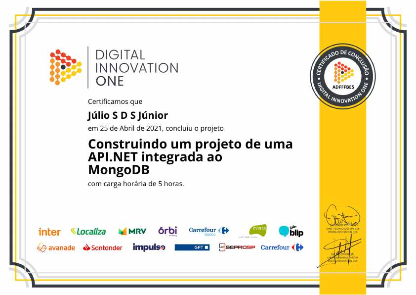

# Construindo um projeto de uma API.NET integrada ao MongoDB
## [Digital Innovation One](https://web.digitalinnovation.one/)

* MongoDB
* .NET Core C#

Instrutor: Gabriel Faraday

"Construiremos um projeto de uma API em .NET Core integrada a um cluster MongoDB, que também criaremos em tempo real no service cloud Mongo Atlas. Vamos repassar brevemente os conceitos básicos de front-end, back-end, bases de dados, NoSQL e MongoDB para fixar o entendimento e sua aplicabilidade."

